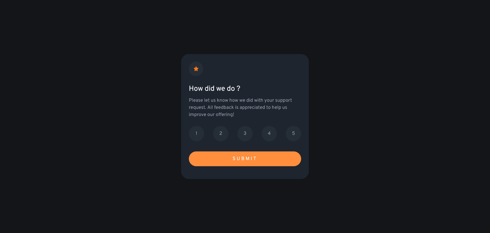
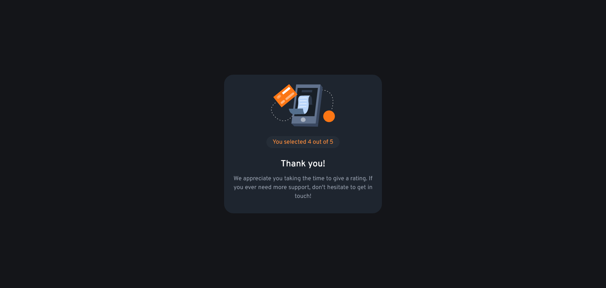

# Frontend Mentor - Interactive rating component solution

This is a solution to the [Interactive rating component challenge on Frontend Mentor](https://www.frontendmentor.io/challenges/interactive-rating-component-koxpeBUmI). Frontend Mentor challenges help you improve your coding skills by building realistic projects. 

## Table of contents

- [Overview](#overview)
  - [The challenge](#the-challenge)
  - [Screenshot](#screenshot)
  - [Links](#links)
- [My process](#my-process)
  - [Built with](#built-with)
  - [What I learned](#what-i-learned)
  - [Continued development](#continued-development)
- [Author](#author)

## Overview

### The challenge

Users should be able to:

- View the optimal layout for the app depending on their device's screen size
- See hover states for all interactive elements on the page
- Select and submit a number rating
- See the "Thank you" card state after submitting a rating

### Screenshot

### Links

- Solution URL: [https://www.frontendmentor.io/solutions/fully-fonctionable-page-1hmWE9mDNA](https://www.frontendmentor.io/solutions/fully-fonctionable-page-1hmWE9mDNA)
- Live Site URL: [https://bulofed.github.io/interactive-rating/](https://bulofed.github.io/interactive-rating/)

## My process

### Built with

- CSS Root / Variables
- Grid / Flex

### What I learned

- Better positioning
- The usage of childs in CSS
- Some basic JS functions

### Continued development

I really want to learn SCSS and learn more about accessibility.
I also want to develop my JS skills.

## Author

- Frontend Mentor - [@bulofed](https://www.frontendmentor.io/profile/bulofed)